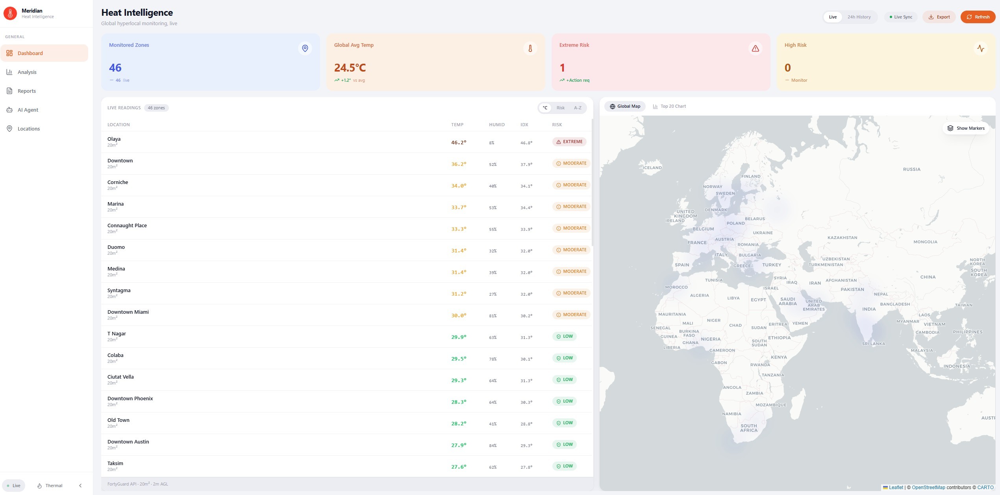
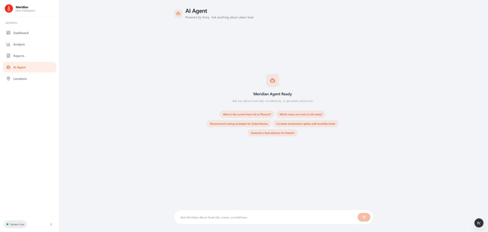
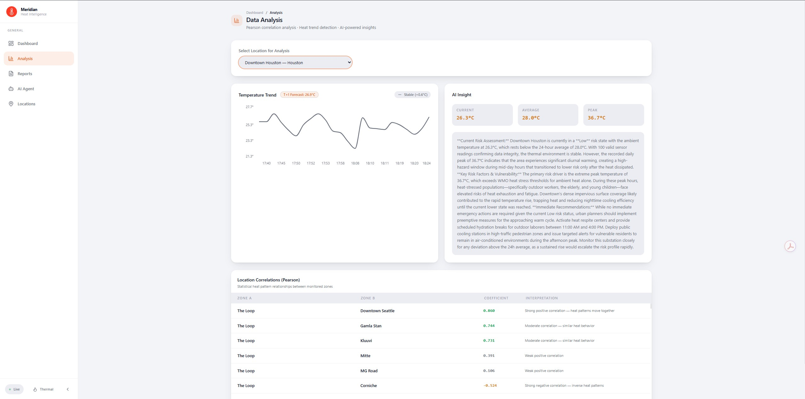
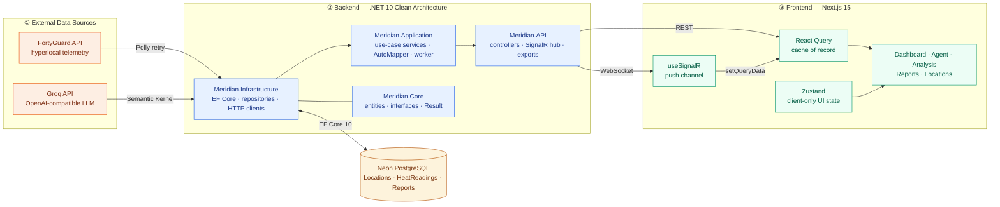
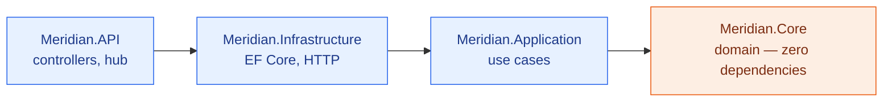
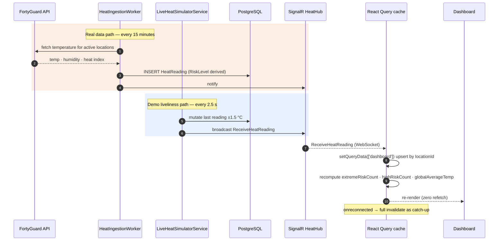
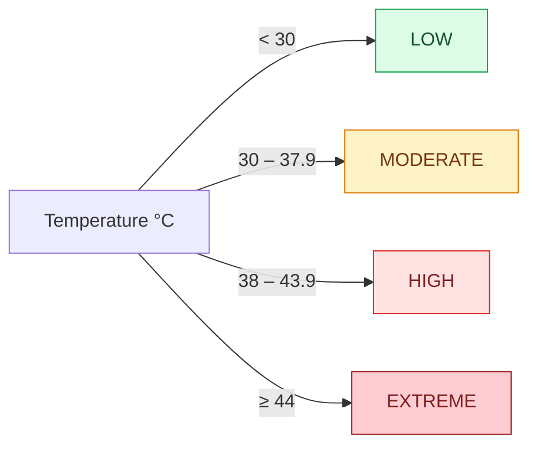

<div align="center">
  

  <h1>Meridian</h1>

  <p><strong>Enterprise Urban Heat Intelligence &amp; Autonomous Advisory Platform</strong></p>

  <p>Built for the <strong>FortyGuard Hackathon</strong> — turning hyperlocal temperature telemetry into decisions cities can act on.</p>

  <p>
    
    
    
    
    
    
  </p>
</div>

---

## Overview

Cities do not get hot uniformly. A single street can run **8–10 °C hotter** than a park four blocks away, and that difference is where heat illness, energy spikes, and infrastructure stress actually concentrate. City-scale weather feeds average this signal away.

**Meridian** ingests **hyperlocal 20 m² resolution temperature data from the FortyGuard API**, stores it as an append-only time series, derives a risk classification per zone, streams changes to an operations dashboard in real time, and puts a **Groq-hosted LLM agent** on top so an analyst can ask questions in plain language and get a government-ready heat advisory back.

| | |
|---|---|
| **Problem** | Urban heat risk is hyperlocal, but decision-makers see city-wide averages. |
| **Input** | FortyGuard hyperlocal telemetry — 20 m², 2 m above ground level. |
| **Output** | Live risk dashboard, correlation analysis, and AI-authored PDF/Excel advisories. |
| **Scale tested** | 47 monitored zones streaming concurrently across 4 continents. |

---

## Screenshots

### Live Operations Dashboard
Real-time KPI tiles, sortable live-readings table, and a global Leaflet heatmap. Updates arrive over SignalR and patch the client cache directly — no polling.



### Conversational AI Agent
Token-streamed analysis over the live dataset, powered by Groq via Microsoft Semantic Kernel.



### Statistical Analysis
Pearson correlation between monitored zones, per-location temperature trends, and LLM-generated insight.



---

## System Architecture

Meridian is a two-tier system: a **.NET 10 Clean Architecture API** and a **Next.js 15 App Router frontend**, joined by REST for queries and SignalR for push.



### Dependency direction

The dependency arrow points **inward only** — `Core` knows nothing about the outside world, which keeps domain logic testable and swappable.



Each layer exposes its own `DependencyInjection.cs` (`AddApplication()` / `AddInfrastructure()`) which `Program.cs` composes — so wiring stays local to the layer that owns it.

---

## Real-Time Data Flow

Two **independent** background services write `HeatReading` rows. Knowing which one you are looking at matters when reasoning about data freshness.



> [!IMPORTANT]
> `LiveHeatSimulatorService` (2.5 s tick by default) exists to keep the demo visually alive — it is **not** real telemetry. Disable it with `Simulator__Enabled=false` before drawing conclusions about data volume or freshness. `HeatIngestionWorker` (15 min poll) is the real FortyGuard path. `DataRetentionService` trims raw readings past 7 days so neither writer can grow the table without bound.

### Why SignalR patches the cache instead of triggering refetches

React Query is the **cache of record**. When a reading arrives, `useSignalR` merges it into `['dashboard']` with `setQueryData` and recomputes the aggregates client-side. That gives zero-latency updates without a network round-trip, which is why `refetchOnWindowFocus` is deliberately **off** — SignalR, not window focus, is the freshness mechanism.

---

## Risk Classification

`RiskLevel` is derived from temperature at write time via `RiskLevelExtensions.FromTemperature`, stored on the reading, and serialized as a **string** over JSON (both MVC and the SignalR protocol) so the frontend union type stays readable.



| Level | Range (°C) | Marker |
|---|---|---|
| `Low` | `< 30` | `#22c55e` |
| `Moderate` | `30 – 37.9` | `#f59e0b` |
| `High` | `38 – 43.9` | `#ef4444` |
| `Extreme` | `>= 44` | `#7c2d12` |

Keep the frontend `RiskLevel` string union in sync with `Meridian.Core.Common.RiskLevel`.

---

## Tech Stack

### Backend

| Concern | Choice | Notes |
|---|---|---|
| Runtime | **.NET 10** Web API | Clean Architecture, 4 projects |
| Data | **EF Core 10** + Npgsql → **Neon PostgreSQL** | migrations auto-apply on startup |
| AI | **Microsoft Semantic Kernel 1.80** → Groq | `AddOpenAIChatCompletion` pointed at Groq's OpenAI-compatible endpoint |
| Resilience | **Polly** | FortyGuard: 3× 500 ms · Groq: exponential backoff, handles 429, 2 min timeout |
| Realtime | **SignalR** | hub at `/hubs/heat` |
| Mapping | **AutoMapper 16** | entity → response DTOs |
| Validation | **FluentValidation 11** | request validation |
| Logging | **Serilog** | structured console sink |
| Export | **QuestPDF** + **ScottPlot** · **ClosedXML** | PDF with charts · Excel |
| Docs | **Swashbuckle** | Swagger UI at `/swagger` in Development |

### Frontend

| Concern | Choice | Notes |
|---|---|---|
| Framework | **Next.js 15** App Router + **React 19** | |
| Server state | **TanStack React Query 5** | cache of record; SignalR patches it directly |
| Client state | **Zustand 5** | selected location, agent transcript — UI only |
| Realtime | **@microsoft/signalr 10** | `useSignalR` hook |
| Mapping | **Leaflet** + **react-leaflet** + **leaflet.heat** | Carto basemap tiles |
| Charts | **Recharts 3** | loaded client-side only |
| HTTP | **Axios** | shared instance, error-normalizing interceptor |
| Styling | **Tailwind CSS v4** | CSS custom-property design tokens |
| Type safety | **TypeScript 5** strict | |

---

## API Reference

All routes are prefixed `api/[controller]`. Global fixed-window rate limit: **60 req/min**.

| Method | Endpoint | Purpose |
|---|---|---|
| `GET` | `/api/heat` | All heat readings |
| `GET` | `/api/heat/dashboard` | Aggregated dashboard snapshot (KPIs + latest per zone) |
| `GET` | `/api/heat/location/{locationId}` | Readings for one zone |
| `GET` | `/api/heat/history` | Historical series |
| `POST` | `/api/heat/ingest` | Trigger a FortyGuard ingestion pass |
| `GET` | `/api/location` | List monitored zones |
| `POST` | `/api/location` | Create a zone |
| `POST` | `/api/location/bulk` | Bulk CSV-style zone import |
| `DELETE` | `/api/location/{id}` | Delete a zone |
| `DELETE` | `/api/location/all` | Clear all zones |
| `GET` | `/api/analysis/correlations` | Pearson correlation across zones |
| `GET` | `/api/analysis/trend/{locationId}` | Temperature trend for a zone |
| `GET` | `/api/analysis/location/{locationId}` | Per-zone analysis |
| `POST` | `/api/agent/query` | One-shot LLM analysis |
| `POST` | `/api/agent/stream` | Token-streamed analysis (`IAsyncEnumerable`) |
| `POST` | `/api/report/generate` | Generate an AI advisory report |
| `GET` | `/api/report` | List reports |
| `DELETE` | `/api/report/{id}` | Delete a report |
| `GET` | `/api/export/pdf` | PDF export (QuestPDF + ScottPlot charts) |
| `GET` | `/api/export/excel` | Excel export (ClosedXML) |

**Realtime:** `WS /hubs/heat` → event `ReceiveHeatReading`

---

## Getting Started

### Prerequisites

- [.NET 10 SDK](https://dotnet.microsoft.com/download)
- [Node.js 18+](https://nodejs.org/)
- A PostgreSQL connection string ([Neon](https://neon.tech/) free tier works)
- API keys for **FortyGuard** and **Groq**

### 1. Backend

Create `backend/Meridian.API/appsettings.Development.json` (gitignored):

```json
{
  "ConnectionStrings": {
    "DefaultConnection": "Host=...;Database=...;Username=...;Password=...;SSL Mode=Require"
  },
  "FortyGuard": { "ApiKey": "your-fortyguard-key" },
  "Groq": { "ApiKey": "your-groq-key" }
}
```

```bash
cd backend/Meridian.API
dotnet run
```

API starts on **http://localhost:5250** (https://localhost:7142). EF Core migrations apply automatically on startup — no separate migration step for local dev. Swagger UI: **http://localhost:5250/swagger**

### 2. Frontend

```bash
cd frontend
cp .env.example .env.local     # NEXT_PUBLIC_API_URL=http://localhost:5250
npm install
npm run dev
```

App starts on **http://localhost:3000**.

> [!NOTE]
> Start the backend **first**. The frontend opens a SignalR connection on mount; if the API is not up you will see `FailedToNegotiateWithServerError` in the console until it is.

### Useful commands

```bash
# Backend
dotnet build backend/Meridian.slnx
cd backend/Meridian.API && dotnet ef migrations add <Name> -p ../Meridian.Infrastructure -s .
cd backend/Meridian.API && dotnet ef database update -p ../Meridian.Infrastructure -s .

# Frontend
cd frontend && npm run build
cd frontend && npx tsc --noEmit    # type-check
```

---

## Project Structure

```
Meridian/
├── backend/
│   ├── Meridian.Core/            # Entities, interfaces, Result<T> — no dependencies
│   │   ├── Entities/             # Location, HeatReading, Report
│   │   └── Common/               # RiskLevel, Result pattern
│   ├── Meridian.Application/     # Use-case services, AutoMapper profiles
│   │   └── Services/             # HeatIngestionWorker (15-min FortyGuard poll)
│   ├── Meridian.Infrastructure/  # EF Core, repositories, external clients
│   │   ├── Repositories/         # Repository<T> + heat/location/report repos
│   │   ├── External/             # FortyGuardClient, GroqAgentService
│   │   └── Migrations/           # incl. AddHeatReadingIndex
│   └── Meridian.API/             # Controllers, SignalR hub, exports
│       ├── Controllers/          # Heat, Location, Analysis, Agent, Report, Export
│       ├── Hubs/                 # HeatHub → /hubs/heat
│       ├── Services/             # LiveHeatSimulatorService (2.5-s demo tick)
│       └── Exports/              # QuestPDF + ScottPlot, ClosedXML
└── frontend/
    ├── public/logo.png
    └── src/
        ├── app/                  # / · /agent · /analysis · /locations · /reports
        │   └── globals.css       # design tokens (@theme + :root)
        ├── components/
        │   ├── ui/               # Button, Card, Badge, RiskBadge, CommandPalette
        │   ├── shared/           # Sidebar, GlobalAlerts
        │   └── features/         # dashboard widgets, TimeLapseSlider
        ├── hooks/useSignalR.ts   # push channel → React Query cache
        └── lib/                  # axios client, Zustand store
```

---

## Performance Engineering

Speed is treated as a standing constraint, not a late optimization pass.

- **Database** — indexed, filtered, paged queries instead of full-table loads; `AsNoTracking()` on read paths; an explicit EF migration (`AddHeatReadingIndex`) rather than relying on PK-only indexing; N+1 patterns on `HeatReading → Location` actively avoided.
- **API** — hot paths (dashboard, ingestion, broadcast) are async end-to-end and allocation-light; a **single reused** `HttpClient` per integration with Polly policies rather than per-request clients.
- **Frontend** — React Query stays the only fetch surface; heavy client-only libraries (Leaflet, Recharts) sit behind `dynamic(..., { ssr: false })`; the `CommandPalette` dashboard query is gated on `enabled: open` so it cannot fire on every route; unused dependencies (Mapbox GL) were audited out.

### A cascade-layer bug worth documenting

An unlayered reset in `globals.css` —

```css
* { box-sizing: border-box; margin: 0; padding: 0; }
```

— was silently zeroing **every** Tailwind spacing utility app-wide. Tailwind v4 emits utilities inside `@layer utilities`, and **unlayered CSS always outranks layered CSS** regardless of specificity, so `p-3`, `px-5`, and `py-2` all computed to `0px`. The fix was to move base styles into `@layer base` and drop the duplicate reset, since Tailwind preflight already handles it in the correct layer.

---

## Design System

Light, flat, and deliberately low-chrome — a Vercel-adjacent operations register.

| Token group | Values |
|---|---|
| Surfaces | `--bg-base` `#F3F4F8` · `--bg-subtle` · `--bg-elevated` `#FFFFFF` |
| Accent | `--accent` `#EA580C` (heat orange), single accent, no gradients |
| Borders | hairline `--border-subtle` / `--border-default` |
| Risk | `--risk-low` `--risk-moderate` `--risk-high` `--risk-extreme` |
| KPI tints | 4 flat pastel bg/fg pairs, each bound to a real metric |
| Shape | `rounded-full` pills · `rounded-xl` nav · `rounded-2xl/3xl` cards |

All tokens live in `src/app/globals.css` as CSS custom properties, re-exposed to Tailwind v4 through `@theme` so opacity modifiers (`bg-accent/10`) work. **Change a token there rather than hardcoding a color in a component.** Semantic risk colors are intentionally independent of the neutral/accent palette.

---

## License

Built for the **FortyGuard Hackathon**.

<div align="center">
  <sub>FortyGuard API · 20 m² resolution · 2 m AGL</sub>
</div>
